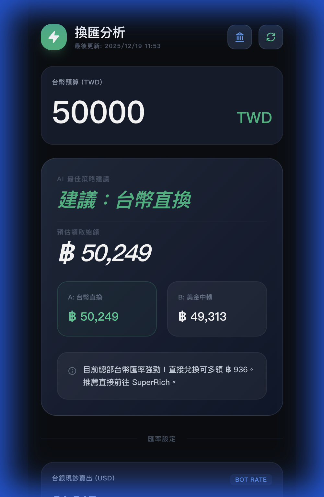

# SR-BOT Pro Exchange (換匯分析) 🚀



這是一個專為 iPhone 17 Pro 螢幕優化的泰銖換匯分析工具。它能即時抓取 **台灣銀行 (BOT)** 與 **SuperRich Thailand** 的匯率，並自動計算「台幣直換」與「美金中轉」哪種方式最划算。

## ✨ 核心功能

- **📱 iPhone 17 Pro 優化**：完美支援 402x874 邏輯解析度，具備高質感的深色模式與流暢動態效果。
- **🔄 Production-Ready Live Sync**：整合 Express 後端與 Playwright 爬蟲，支援雲端部署（如 Render）並能即時更新官網匯率。
- **🤖 AI 最佳策略建議**：自動對比匯率差額，直接告訴您在哪裡換錢能換到最多泰銖。
- **🔗 一鍵跳轉**：快速存取台銀與 SuperRich 官網匯率頁面。
- **⌨️ 優化輸入體驗**：改良數字輸入框邏輯，防止領先零 (Leading Zeros) 並支援完全清除數值。

## 🛠️ 技術架構

- **Frontend**: React, Vite, Tailwind CSS, Lucide Icons
- **Backend**: Node.js, Express (生產環境伺服器)
- **Scraping**: Playwright (自動繞過 CORS 與 401 驗證，獲取最新真實匯率)
- **Design**: Premium High-Impact Dark UI

## 🌐 雲端部署 (以 Render 為例)

本專案已針對 Render **Web Service** 進行優化：

- **Service Type**: Web Service
- **Build Command**: `npm install && npm run build`
- **Start Command**: `npm start`

> [!NOTE]
> 部署時建議使用 Node 20+ 環境，系統會自動在 `postinstall` 階段安裝 Playwright 瀏覽器所需環境。

## 🚀 如何本地運行

### 1. 安裝環境
```bash
git clone https://github.com/lawrence555-dev/sr-bot-pro-exchange.git
cd sr-bot-pro-exchange
npm install
```

### 2. 開發模式 (Vite)
```bash
npm run dev
```

### 3. 生產模式模擬 (Express)
```bash
npm run build
npm start
```

## 📁 專案結構

- `src/App.jsx`: 前端 UI 邏輯與動態匯率計算。
- `server.js`: 生產環境 Express 伺服器，負責靜態檔案與爬蟲 API。
- `scripts/scraper.js`: 核心爬蟲腳本，抓取台銀與 SuperRich 數據。
- `src/data/rates.json`: 匯率數據快照儲存位置。

---
*Developed by Lawrence & Antigravity - Optimized for iPhone 17 Pro*
