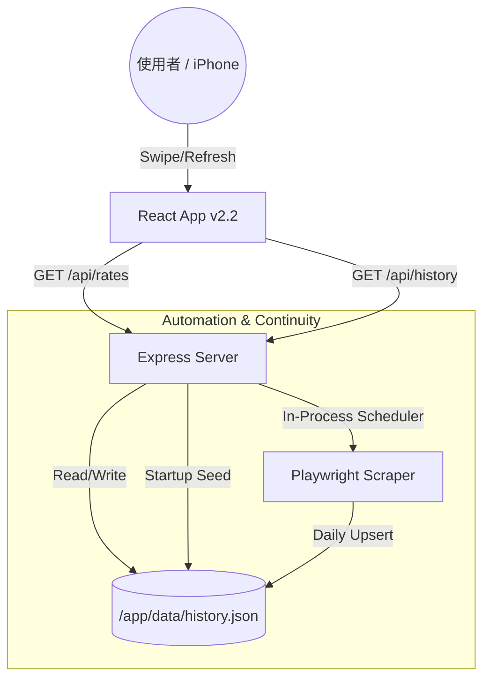

# SR-Bot Pro Exchange


這是一個專為 iPhone 17 Pro 與現代網頁設計優化的泰銖換匯分析工具。本專案引入了 **全自動化排程**、**資料持久化** 與 **30 天趨勢分析** 功能。

## 核心更新

- **30 天互動趨勢圖表**：使用 `Recharts` 繪製「台幣直換」vs「美金中轉」的走勢比較，支援手指滑動顯示詳細數值。
- **資料持久化 (Persistent Storage)**：支援 Zeabur Volume 掛載，確保歷史匯率在重新部署後依然保存。
- **沉浸式 UI 佈局**：將輸入框與計算邏輯整合進「換匯卡片」，滑動至「趨勢圖」時自動隱藏，提供更純粹的數據分析視野。
- **自動化排程**：內建 `node-cron`，每日台灣時間 23:50 自動抓取並存檔。
- **Premium Glassmorphism UI**：高品質的毛玻璃設計語彙，優化視覺體驗。

## 技術架構

- **Backend**: Node.js, Express
- **Scraping**: Playwright (Headless Browser) + Axios
- **Visualization**: Recharts (前端互動繪圖)
- **Scheduling**: node-cron (時區校正: Asia/Taipei)
- **Data Store**: JSON File Store (Designed for Volume Mounting)

## 系統架構 (System Architecture)



## 雲端部署 (Zeabur)

本專案已完全針對 **Zeabur** 平台優化：

### 1. 建立服務
- 選擇 **Git** 部署，連結本專案。
- Zeabur 會自動偵測並部署 Node.js 環境。

### 2. 掛載持久化硬碟 (必做！)
為了讓歷史匯率不隨容器重啟而消失，請務必掛載 Volume：
- **Volume ID**: 自訂 (例如 `data`)
- **Mount Path**: `/app/data` (⚠️ 必須完全一致)

### 3. 環境變數 (Environment Variables)
- `TZ`: `Asia/Taipei` (建議設定，確保 Log 時間正確)

## API 文件

| Endpoint | Method | 描述 |
|----------|--------|------|
| `/api/rates` | GET | 取得最新一筆匯率資料 |
| `/api/history` | GET | 取得最近 30 天的歷史匯率列表 (供圖表使用) |
| `/api/scrape` | GET | 手動觸發爬蟲 (並更新當日資料) |
| `/api/health` | GET | 伺服器健康檢查 |

## 如何本地運行

### 1. 安裝環境
```bash
git clone https://github.com/lawrence555-dev/sr-bot-pro-exchange.git
cd sr-bot-pro-exchange
npm install
npx playwright install chromium
```

### 2. 開發模式
```bash
# 啟動後端與前端 Build
npm start
```
伺服器將運行於 `http://localhost:3000`

---
*Developed by Lawrence & Antigravity - Optimized for Premium Experience*
