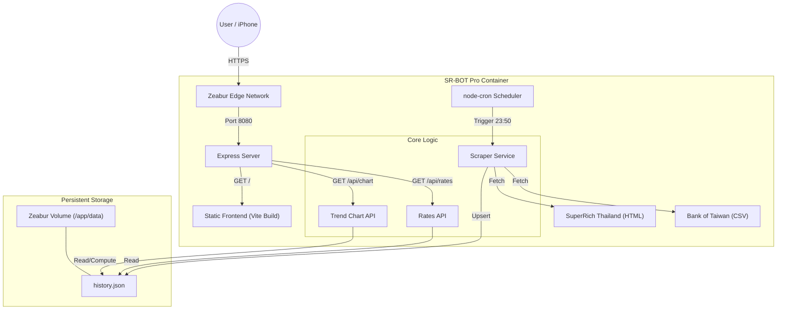
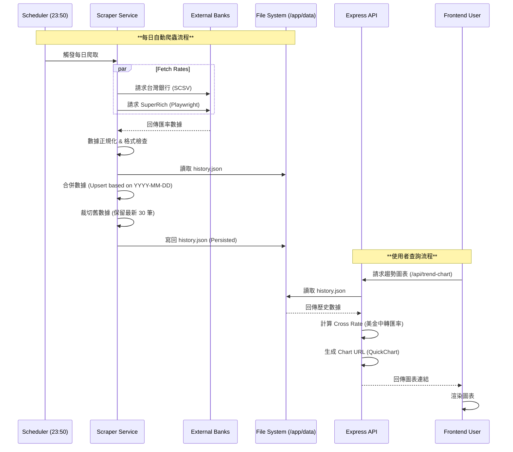

# SR-BOT Pro Exchange v2.1 - 系統分析文件

## 1. 系統架構圖 (System Architecture)

本系統採用輕量化的 **Node.js + File-based Storage** 架構，專為 Zeabur 容器環境與 Volume 掛載設計。

## 2. 資料流流程圖 (Data Flow)

描述資料如何從外部來源抓取、處理、儲存，最後呈現給使用者的完整流程。

## 3. 模組功能分析

### A. 爬蟲模組 (`scripts/scraper.js`)
- **功能**：負責從外部網站獲取原始匯率數據。
- **特點**：
    - **混合抓取策略**：同時使用 `axios` (針對 CSV) 與 `playwright` (針對動態渲染網頁)。
    - **純函數設計**：重構後的爬蟲不涉及資料庫操作，僅回傳標準化 JSON 物件，易於測試與維護。

### B. 伺服器核心 (`server.js`)
- **角色**：系統的中樞神經，整合排程、API 與資料存取。
- **關鍵邏輯**：
    - **資料持久化 (Persistence)**：利用 Zeabur 掛載的 Volume，將資料寫入 `/app/data/history.json`。
    - **每日去重 (Deduplication)**：使用 `dateStr` (YYYY-MM-DD) 作為唯一鍵值，確保同一天多次執行也只會更新同一筆記錄，防止數據膨脹。
    - **自動滾動 (Rolling Retention)**：每次寫入時自動檢查長度，僅保留最近 30 天數據。

### C. 趨勢視覺化 (`/api/trend-chart`)
- **目的**：解決使用者「這時候換划算嗎？」的決策痛點。
- **實現**：
    - 即時計算 **Cross Rate (交叉匯率)**：`srUsd (泰國美金買價) / botUsd (台灣美金賣價)`。
    - 使用 `QuickChart` 生成靜態圖片，減輕前端渲染負擔，並確保在所有裝置 (包含 Line 預覽) 都能正常顯示。

## 4. 部署環境規格

- **平台**：Zeabur
- **容器**：Node.js (LTS)
- **瀏覽器環境**：Playwright Container (`mcr.microsoft.com/playwright`)
- **儲存**：Persistent Volume (1GB+) Mount at `/app/data`
- **時區**：Asia/Taipei (GMT+8)
